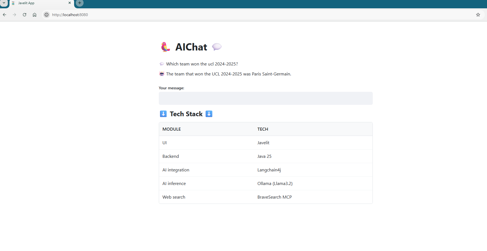

# AIChat With Javelit & Langchain4j

### Tech Stack

[Javelit](https://javelit.io/) is an open-source Java framework for data and backend engineers to deliver dynamic data apps with only a few lines of code.

[Langchain4j](https://docs.langchain4j.dev/) is an open-source Java library that simplifies the integration of LLMs into Java applications

[Ollama](https://ollama.com/) is the easiest way to get up and running with large language models such as gpt-oss, Gemma 3, DeepSeek-R1, Qwen3 and more.

[Brace Seach API](https://brave.com/search/api/) is a developer tool for building applications with data from the Web and [Brave Search MCP Server](https://github.com/modelcontextprotocol/servers-archived/tree/main/src/brave-search) is an MCP server implementation that integrates the Brave Search API, providing both web and local search capabilities.

### Dependencies

```xml
<dependency>
    <groupId>dev.langchain4j</groupId>
    <artifactId>langchain4j-ollama</artifactId>
    <version>1.8.0</version>
</dependency>

<dependency>
    <groupId>dev.langchain4j</groupId>
    <artifactId>langchain4j</artifactId>
    <version>1.8.0</version>
</dependency>

<dependency>
    <groupId>dev.langchain4j</groupId>
    <artifactId>langchain4j-mcp</artifactId>
    <version>1.8.0-beta15</version>
</dependency>

<!-- Java JDK >= 21 -->
<dependency>
    <groupId>io.javelit</groupId>
    <artifactId>javelit</artifactId>
    <version>0.60.0</version>
</dependency>
```
### Example

http://localhost:8080

